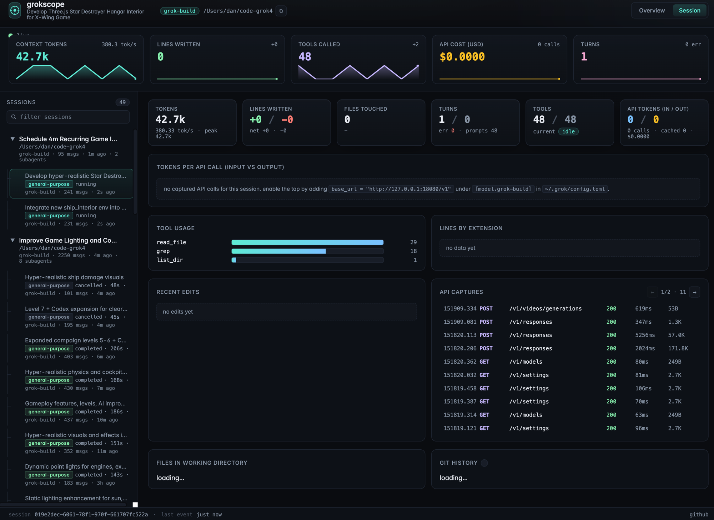

# grokscope

> Third-party tooling for the [Grok CLI](https://docs.x.ai/build/overview).
> Not affiliated with, endorsed by, or sponsored by xAI Corp.

Live monitoring + observability for the [Grok CLI](https://docs.x.ai/build/overview).



`grokscope` watches the JSONL telemetry your local Grok sessions write to `~/.grok/sessions/`
and renders a live web dashboard with tokens, lines of code written, tool usage, and per-API-call
input/output token breakdowns (including cost in USD) when you run alongside the included reverse
proxy.

## Why

The Grok CLI is great but its TUI shows you only the *current turn*. There's no way to glance at
"how much code has the agent written across all sessions today" or "what is the per-call cost so
far" without grepping through `~/.grok/sessions/`. `grokscope` is the X-ray glasses for that.

It has three parts you can mix and match:

| Tool | What it does | When you want it |
|---|---|---|
| **Web dashboard** | Vite + Express SPA with live SSE updates | The pretty version. Open in a browser, leave it on a second monitor. |
| **`grokscope-cli`** (Python) | One-shot or live terminal dashboard | When you want a TUI alongside your shell. |
| **`grokscope-tap`** (Python) | Logging reverse proxy for the xAI API | When you want per-call input/output token + cost breakdowns. Optional but unlocks the richest data. |

## What you get

- **Tokens per session**: running totals, peak context, tokens/sec rolling rate.
- **Input / output tokens per API call** when the tap is in the path, including cached input,
  reasoning output, and cost in USD (extracted from the proxy's `cost_in_usd_ticks` field).
- **Lines of code written**: gross (`eventType=="added"` from `hunk_records.jsonl`) and net live.
- **Tool usage histogram**: which tools the agent leans on (`read_file`, `search_replace`,
  `write`, etc.).
- **Live edits list**: which files just got touched, with line counts.
- **Recent API captures**: when running with the tap enabled.
- **Sessions sidebar**: click to switch which session is in focus. Subagent worktree sessions are
  filtered out by default and surfaced separately.

## Install

```bash
git clone https://github.com/daniel-farina/grokscope.git
cd grokscope
npm install
```

Optionally symlink the CLI tools onto your `PATH`:

```bash
ln -s "$PWD/cli/grok-monitor" ~/.local/bin/grokscope-cli
ln -s "$PWD/cli/grok-tap"     ~/.local/bin/grokscope-tap
```

## Run

### Web dashboard

```bash
npm run dev        # vite frontend on :7777
node server       # api on :7778
```

Then open <http://127.0.0.1:7777>.

Both processes under PM2 with auto-restart on crash:

```bash
pm2 start ecosystem.config.cjs
pm2 list
pm2 logs grok-dashboard-api
```

### CLI dashboard

```bash
cli/grok-monitor              # auto-picks the most recently-updated session
cli/grok-monitor --list       # all sessions
cli/grok-monitor --session <prefix>
cli/grok-monitor --once       # one snapshot then exit
```

### Reverse proxy (for input / output token + cost data)

```bash
cli/grok-tap                  # listens on http://127.0.0.1:18080
```

Then route grok through it by editing `~/.grok/config.toml`:

```toml
[model.grok-build]
base_url = "http://127.0.0.1:18080/v1"
```

Every grok session after that will be captured in `~/.grok-tap/`, and the dashboard will start
rendering per-call token charts.

> Note: avoid passing `--effort` or `--reasoning-effort` to `grok-build`. The proxy explicitly
> rejects those parameters with a 400 for this model. The tap reproduces the 400 in your shell
> logs so you can see the error message.

## Data sources

Everything `grokscope` shows is derived from files Grok already writes:

| Source | Used for |
|---|---|
| `~/.grok/sessions/<cwd>/<id>/summary.json` | model, title, message counts, cwd |
| `~/.grok/sessions/<cwd>/<id>/events.jsonl` | turns, tool calls, phase changes |
| `~/.grok/sessions/<cwd>/<id>/updates.jsonl` | running `totalTokens` for rate calc |
| `~/.grok/sessions/<cwd>/<id>/hunk_records.jsonl` | lines added / removed per file |
| `~/.grok-tap/index.jsonl` + `*-req.txt` / `*-resp.txt` | full per-call usage when the tap is on |

Nothing is uploaded anywhere. The dashboard binds to `127.0.0.1` only.

## API

The dashboard backend exposes a small JSON API on `:7778`:

| Endpoint | Returns |
|---|---|
| `GET /api/health` | health check |
| `GET /api/sessions` | list of all sessions with last-active timestamp |
| `GET /api/session/:id` | full stats for one session including `usage` block |
| `GET /api/active` | full stats for the most-recently-active non-worktree session |
| `GET /api/usage` | aggregated per-call usage across all captures |
| `GET /api/captures` | most recent 100 entries from `~/.grok-tap/index.jsonl` |
| `GET /api/stream` | Server-Sent Events stream of active-session stats (1 Hz) |

## Architecture

```
~/.grok/sessions/...           ~/.grok-tap/
        |                            |
        v                            v
   server/index.js  <--  express api (:7778)
        |
        v
   SSE / fetch
        |
        v
   vite dev server (:7777)
        |
        v
   browser (http://127.0.0.1:7777)
```

The whole backend is ~470 lines of vanilla Node.js (`express` + `cors` + stdlib). The frontend
is ~270 lines of vanilla JS (no React, no charting library, bar charts are CSS divs).

## Customize

- Ports live in `vite.config.js` and `ecosystem.config.cjs` (env `PORT`).
- The "active session" picker logic is in `server/index.js` -> `pickActiveSession()`. It currently
  excludes `~/.grok/worktrees/` paths because those are subagent workspaces; tweak to taste.
- The token-rate window is `TOKEN_WINDOW_SEC = 30` seconds.
- The `usageCache` Map memoizes per-tag parses; if you wipe `~/.grok-tap/` the cache invalidates
  by file mtime.

## License

MIT. See [LICENSE](LICENSE).

## Acknowledgements

Built by reverse-engineering the Grok CLI binary and live-tapping the xAI Responses API. See
`docs/reverse-engineering.md` for notes on how that works.
